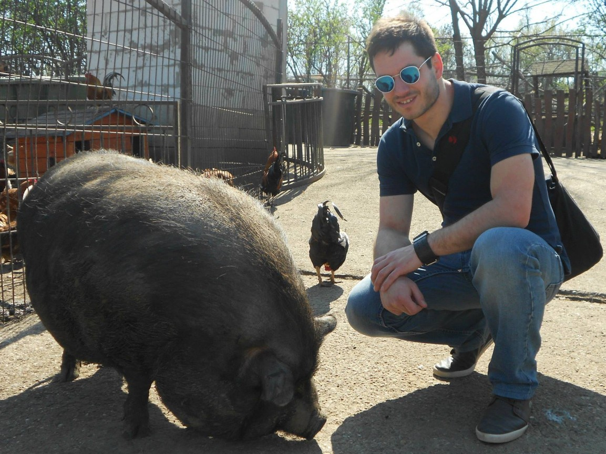

<!--
slug: levente
title: Bemutatkozás
position: 1
-->
# Bemutatkozás

Löki Levente vagyok, budapesti informatikus, debreceni gyökerekkel.
Fő területem a web, de kalandoztam már más irányokba is.
A saját blog és a szakmáról publikálás gondolata régóta foglalkoztat, remélem, meg tudom tölteni tartalommal.
Backend területen talán a TDD és a tiszta kód, kliensoldalon pedig az akadálymentes technológiák foglalkoztatnak leginkább.

* [Honlap](https://www.lokilevente.hu/)
* [Twitter](https://twitter.com/LeventeLoki)
* [GitHub](https://github.com/lencse/)
* [LinkedIn](https://www.linkedin.com/in/lokilevente)
